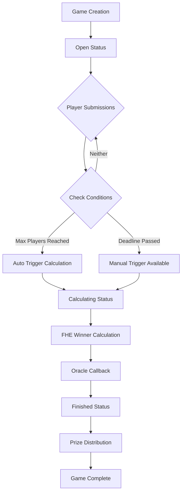

# Optimized FHE Game Flow Documentation

## Game Overview

The Optimized FHE Game is a blockchain game based on Zama FHEVM Fully Homomorphic Encryption technology. Players submit encrypted numbers, and the system calculates winners without decryption, ensuring fairness and privacy throughout the game process.

## Core Game Mechanics

### 🎯 Game Objective
Players must submit a **unique number** within a specified range. If only one player chooses a particular number, that player wins and takes the prize pool.

### 🔑 Key Features
- **Complete Privacy**: Using FHE technology, all numbers remain encrypted throughout the game
- **Fair Competition**: No one can know other players' chosen numbers in advance
- **Automatic Execution**: Smart contracts automatically handle game logic and reward distribution

## Game Lifecycle

### 1. Game Creation Phase

**Creator sets game parameters**:
```typescript
createGame(
  roomName: string,      // Room name (1-64 characters)
  minNumber: number,     // Minimum number
  maxNumber: number,     // Maximum number (range ≤ 255)
  maxPlayers: number,    // Maximum players (≥2)
  entryFee: bigint,      // Entry fee (ETH)
  deadlineDuration: number // Deadline duration (seconds)
)
```

**Game Status**: `Open`

**Event Triggered**: `GameCreated`

### 2. Player Participation Phase

**Players submit encrypted numbers**:
```typescript
submitNumber(
  gameId: number,
  encryptedNumber: Handle,    // FHE encrypted number
  inputProof: bytes,          // Zero-knowledge proof
  { value: entryFee }         // Entry fee
)
```

**Participation Requirements**:
- ✅ Pay correct entry fee
- ✅ Submit before deadline
- ✅ Haven't submitted a number before
- ✅ Game status is `Open`
- ✅ Maximum player limit not reached

**Event Triggered**: `SubmissionReceived`

### 3. Game End Trigger Conditions

The game can end in two ways:

#### Method 1: Maximum Players Reached 🏁
```typescript
// Automatically triggered when player count reaches maxPlayers
if (playerCount == maxPlayers) {
    status = GameStatus.Calculating;
    // Trigger FHE calculation request
    requestWinnerCalculation();
}
```

#### Method 2: Deadline Reached ⏰
```typescript
// Anyone can manually trigger after deadline
findWinnerByDeadline(gameId) external {
    require(block.timestamp > games[gameId].deadline, "Deadline has not passed yet");
    require(games[gameId].playerCount > 0, "No players in the game");
    
    games[gameId].status = GameStatus.Calculating;
    requestWinnerCalculation();
}
```

### 4. Winner Calculation Phase

**Game Status**: `Calculating`

**🎯 Optimized FHE Calculation Process**:
1. **Batch Decryption**: Decrypt all player-submitted encrypted numbers at once
2. **Plaintext Calculation**: Perform efficient calculations on decrypted array
   - Count frequency of each number
   - Find all unique numbers (occurrence = 1)
   - Select minimum value among unique numbers
   - Get winner address directly through index

**Calculation Logic Example**:
```javascript
Decrypted result: [3, 5, 3, 7, 5] // Corresponding players [A, B, C, D, E]
Frequency count: {3: 2, 5: 2, 7: 1}
Unique numbers: [7] 
Minimum unique: 7
Winner index: 3 (position of number 7 in original array)
Winner: gamePlayerAddresses[3] = Player D
```

**Advantages**:
- ⚡ **Optimal Performance**: Only 1 FHE decryption operation needed
- 🧮 **Simple Logic**: Subsequent calculations are low-gas plaintext operations
- 🎯 **Complete Results**: Get both winning number and winner address

**Possible Outcomes**:
- **Has Winner**: Player with unique minimum number found
- **No Winner**: All numbers chosen by multiple players
- **Multiple Unique Numbers**: Player with smallest unique number wins

**Event Triggered**: `WinnerCalculationStarted`

### 5. Result Revelation Phase

**Game Status**: `Finished`

**🎯 Optimized FHE Callback Handling**:
```solidity
// Called by Zama oracle - new simplified callback
function callbackDecryptAllSubmissions(
    uint256 requestId,
    uint32[] memory decryptedNumbers,
    bytes[] memory signatures
) external {
    // 1. Verify signatures and request ID
    FHE.checkSignatures(requestId, signatures);
    
    // 2. Count number frequencies, find unique numbers
    // 3. Select minimum unique number
    // 4. Determine winner through index
    // 5. Update game status and statistics
}
```

**Core Advantages**:
- 🚀 **One-Step Solution**: Directly determine final winner from decryption results
- 📊 **Complete Information**: Winning number + winner address + game results
- ⛽ **Gas Optimization**: Avoids complex FHE comparison operations

**Processing Flow**:
1. **Verification**: Signature verification and request ID mapping
2. **Statistics**: Calculate frequency of each number  
3. **Filtering**: Find all unique numbers (frequency = 1)
4. **Selection**: Choose minimum value among unique numbers
5. **Determination**: Get winner address directly through array index
6. **Update**: Save results and update statistics

**Events Triggered**: 
- `WinnerDetermined` (has winner)
- `NoWinnerDetermined` (tie refund)

### 6. Prize Claiming Phase

**Winner Scenario**:
- Winner calls `claimPrize()` to claim entire prize pool
- Prize pool transferred to winner in one transaction
- Game status becomes `PrizeClaimed`

**Tie Refund Mechanism** 🔄:
- If no winner, refund mechanism activates
- Each participant can claim **90% entry fee refund**
- **10% as platform fee**, accumulated to platform fee pool
- Call `claimRefund(gameId)` to request refund

**Platform Fee Management** 💰:
- Contract creator can call `withdrawPlatformFees()` to extract accumulated fees
- Only contract owner has permission to withdraw
- Supports ownership transfer functionality

**Player Statistics Update**:
- Games played count (`gamesPlayed`)
- Games won count (`gamesWon`)
- Total winnings (`totalWinnings`)

**Winner History Record**: Recorded to global winner history

## Game State Flow Diagram



## Important Time Points

### Deadline Handling ⏰

**Before Deadline** (`block.timestamp <= deadline`):
- ✅ Players can submit numbers
- ❌ Cannot manually trigger calculation

**After Deadline** (`block.timestamp > deadline`):
- ❌ Players cannot submit numbers anymore
- ✅ Anyone can call `findWinnerByDeadline()`
- ✅ If players participated, automatically start calculation

### Maximum Player Count Handling 👥

**Not Full** (`playerCount < maxPlayers`):
- ✅ Continue accepting new players
- ❌ Don't trigger automatic calculation

**Full** (`playerCount == maxPlayers`):
- ❌ No longer accept new players
- ✅ Immediately trigger winner calculation
- ⚡ Start calculation even before deadline

## Special Case Handling

### No Player Participation
```typescript
// If no one participated after deadline
require(games[gameId].playerCount > 0, "No players in the game");
```

### Duplicate Calculation Protection
```typescript
// Prevent duplicate calculation triggers
require(games[gameId].status == GameStatus.Open, "Game is not open");
```

### Tie Handling Logic 🎯

**Winner Determination Rules**:
1. **Unique Number**: Number chosen by only one player
2. **Minimum Priority**: If multiple unique numbers, choose smallest
3. **No Winner**: All numbers chosen by multiple players

**Tie Scenarios**:
```typescript
// Case 1: All players choose same number → No winner, refund
// Player A: 5, Player B: 5, Player C: 5 → Refund

// Case 2: Multiple unique numbers → Minimum wins
// Player A: 1, Player B: 5, Player C: 8 → Player A wins (chose 1)

// Case 3: Mixed scenario → Find unique minimum
// Player A: 2, Player B: 2, Player C: 7 → Player C wins (7 unique)
```

### Refund Security Mechanism 🛡️

**Prevent Duplicate Claims**:
```typescript
mapping(uint256 => mapping(address => bool)) public hasClaimedRefund;
require(!hasClaimedRefund[gameId][msg.sender], "Refund already claimed");
```

**Participation Verification**:
```typescript
require(hasPlayerSubmitted[gameId][msg.sender], "You did not participate");
```

**Fee Distribution**:
- **Player Refund**: 90% entry fee (`REFUND_PERCENTAGE = 9000`)
- **Platform Fee**: 10% entry fee (automatically accumulated to `platformFees`)

### Mock Environment Limitations
- In test environment, FHE callbacks won't execute automatically
- Game status will remain in `Calculating`
- Need to manually simulate callback process for complete testing

## 🚀 Technical Optimization Highlights

### New Architecture Advantages

**Original vs Optimized Solution Comparison**:

| Aspect | Original Solution | 🎯 Optimized Solution |
|------|----------|------------|
| **FHE Decryption Count** | 2 times (number→index) | **1 time** (batch decryption) |
| **FHE Comparison Operations** | Many complex loops | **0 times** |
| **Gas Cost** | High | **Significantly reduced** |
| **Code Complexity** | Complex FHE logic | **Simple plaintext calculation** |
| **Winner Determination** | Multi-step | **One-step solution** |

### Core Technical Innovation

**🔍 Smart Decryption Strategy**:
```solidity
// Old approach: Find number first, then find player (2 decryptions)
1. Decrypt winning number → 2. Decrypt all submissions to find player

// New approach: Decrypt all directly, complete calculation in one step (1 decryption)  
1. Batch decrypt all submissions → 2. Plaintext calculation to determine winner
```

**📊 Algorithm Optimization**:
```javascript
// Efficient winner calculation algorithm
function findWinner(numbers: number[]): {winner: address, number: number} {
    // O(n) time complexity, complete all calculations in one traversal
    const frequency = countFrequency(numbers);      // Count frequency
    const uniqueNumbers = getUniqueNumbers(frequency); // Find unique numbers  
    const minUnique = Math.min(...uniqueNumbers);      // Find minimum
    const winnerIndex = numbers.indexOf(minUnique);    // Find winner index
    return { winner: players[winnerIndex], number: minUnique };
}
```

## Query Functions

### Game Queries
- `getAllGames()`: Get all games
- `getActiveGames()`: Get active games
- `getGamesByStatus(status)`: Filter games by status
- `getGameSummary(gameId)`: Get game summary
- `canFinalizeGame(gameId)`: Check if game can be finalized

### Player Statistics
- `getPlayerStats(player)`: Get player statistics
- `getPlayerGames(player)`: Get games player participated in
- `getLeaderboard(limit)`: Get leaderboard
- `getWinnerHistory(limit)`: Get winner history

### Tie and Refund Queries
- `canClaimRefund(gameId, player)`: Check if can claim refund
- `hasClaimedRefund(gameId, player)`: Check if already claimed refund
- `getPlatformFees()`: Get current platform fee balance

### Platform Management
- `owner()`: Get contract owner
- `withdrawPlatformFees()`: Withdraw platform fees (owner only)
- `transferOwnership(newOwner)`: Transfer ownership (owner only)

## Security Considerations

### Input Validation
- Room name length limit (1-64 characters)
- Number range validation (maximum 255 range)
- Minimum player count limit (≥2)
- Entry fee exact matching

### Replay Attack Prevention
- Player submission status tracking
- Strict game status control
- Timestamp verification

### FHE Security
- Zero-knowledge proof verification
- Oracle permission control
- Encrypted data integrity

### Tie Refund Security 🔒
- **Reentrancy Attack Protection**: Uses Check-Effects-Interactions pattern
- **Duplicate Claim Protection**: `hasClaimedRefund` mapping tracking
- **Permission Verification**: Only participants can claim refunds
- **Mathematical Precision**: Uses `PERCENTAGE_BASE = 10000` for accuracy

### Platform Fee Security
- **Ownership Control**: Only contract owner can withdraw
- **Zero Address Protection**: Prevents ownership transfer to zero address
- **Balance Check**: Verify balance exists before withdrawal

### Production Environment Considerations
- **Gas Optimization**: FHE operations consume more gas than regular operations
- **Event Listening**: Client needs to listen for `NoWinnerDetermined` and `RefundClaimed` events
- **Error Handling**: Comprehensive error messages and rollback mechanisms

---

*This document is written based on analysis of UniqueNumberGameFactory.sol contract and related test files.*