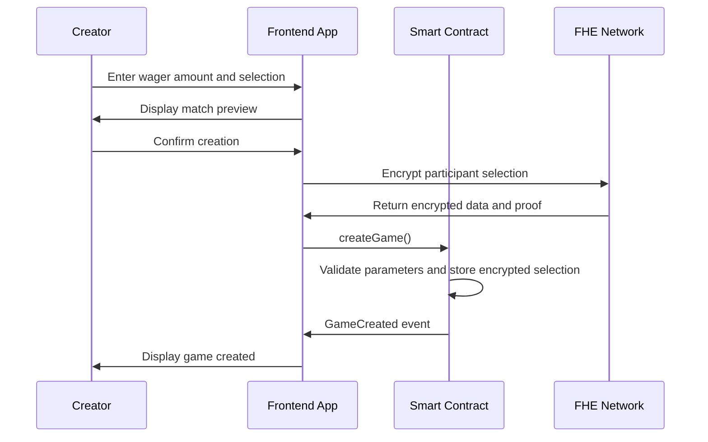
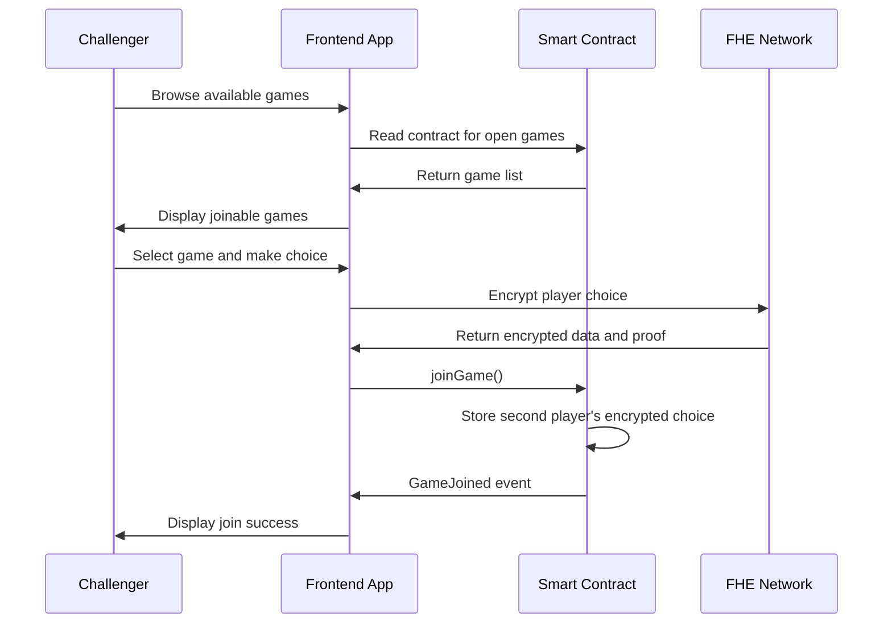
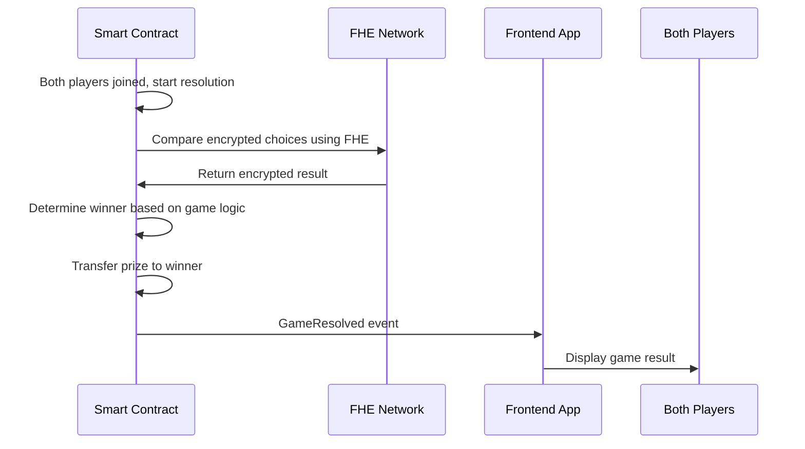
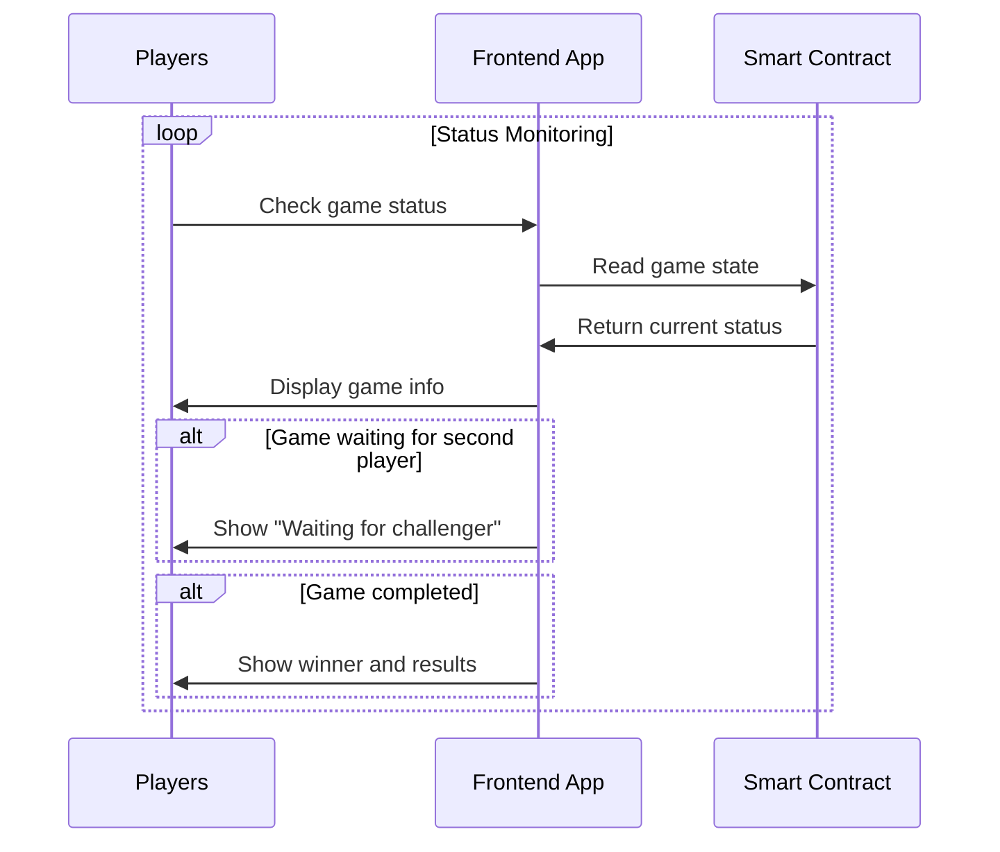

# Game Flow Documentation

This comprehensive guide details the complete operational flow of Number Verse Arena, encompassing user interactions, contract executions, and state transitions.

## 🎮 Game Architecture Overview

Number Verse Arena represents an innovative Web3 Player vs Player competitive experience leveraging FHE (Fully Homomorphic Encryption) technology. Participants select between 1 or 2 through encrypted mechanisms, with the victor claiming the complete wager amount.

### Primary Features
- 🔐 **Privacy Preservation**: Utilizes FHE encryption, participant selections maintain absolute confidentiality until match conclusion
- 🏆 **Equitable Competition**: All encrypted operations execute on-chain, guaranteeing fairness
- 💰 **Complete Prize Pool**: Victor receives the entire wager amount from both participants
- ⚡ **Direct Competition**: Head-to-head 1v1 battles between two participants

## 📋 Match Regulations

### Fundamental Rules
1. **Match Initiation**: Any participant can establish a match with their wager amount
2. **Selection Process**: Participants choose between 1 or 2
3. **Victory Determination**: Match logic determines victor based on encrypted selections
4. **Prize Allocation**: Victor claims the complete wager amount (2x their original wager)
5. **Participant Limitation**: Each match accommodates exactly 2 participants

### Victory Prerequisites
- ✅ Executed the winning selection according to match logic
- ✅ Submitted selection before second participant joins
- ✅ Transmitted correct wager amount

### Defeat Conditions
- ❌ Executed the losing selection according to match logic
- ❌ Failed to submit before match completion
- ❌ Did not transmit correct wager amount

## 🔄 Complete Match Flow

### Phase 1: Match Creation


**Detailed Steps:**
1. Player visits "Create Game" page
2. Fill game configuration:
   - Bet amount (ETH)
   - Choice selection (1 or 2)
3. Frontend validates input parameters
4. Encrypt player choice using FHE
5. Call `createGame()` contract function with encrypted choice and bet
6. Contract creates game and stores encrypted choice
7. Trigger `GameCreated` event
8. Frontend displays creation success, obtain game ID

### Phase 2: Player Joining


**Detailed Steps:**
1. Player visits "Join Game" page
2. Frontend reads contract to get available games
3. Display game list including:
   - Game ID
   - Bet amount
   - Creator status
4. Player selects game and makes their choice (1 or 2)
5. Frontend encrypts player choice using FHE
6. Call `joinGame()` contract function with encrypted choice and matching bet
7. Contract stores second player's encrypted choice
8. Trigger `GameJoined` event
9. Game automatically proceeds to resolution

### Phase 3: Game Resolution


**Detailed Steps:**
1. **Automatic Trigger**: When second player joins, game resolution begins automatically
2. **FHE Computation**: 
   - Contract uses FHE operations to compare encrypted choices
   - Game logic determines winner without revealing individual choices
   - Winner is determined based on the encrypted comparison result
3. **Prize Distribution**:
   - Winner receives the total bet amount (2x their original bet)
   - Loser loses their bet amount
4. **Event Emission**: Contract emits `GameResolved` event with winner information
5. **Frontend Update**: Players can see the game result and their win/loss status

### Phase 4: Game Status Monitoring


**Detailed Steps:**
1. Players can monitor game status in real-time
2. Frontend displays:
   - Game state (waiting/completed)
   - Bet amount
   - Player addresses (if both joined)
   - Winner information (if game completed)
3. No manual winner determination needed - automatic upon second player joining

## 🎯 User Interface Flow

### Homepage Flow
```
Homepage → Display game introduction
    ├── Create Game → Create game page
    └── Join Game → Game selection page
```

### Create Game Flow
```
Create Game Page
├── Enter bet amount
├── Select choice (1 or 2)
├── Preview game configuration
└── Confirm creation → Game created
```

### Join Game Flow
```
Join Game Page
├── Browse available games
├── Select game to challenge
├── Make choice (1 or 2)
├── Confirm bet amount matches
└── Join game → Game resolves automatically
```


## 📊 State Management

### Game States
- **Waiting** (0): Game created, waiting for second player
- **Completed** (1): Both players joined, game resolved automatically

### Frontend States
- **Loading**: Data loading
- **Connected**: Wallet connected
- **Creating**: Creating new game
- **Joining**: Joining existing game
- **Waiting**: Game created, waiting for challenger
- **Completed**: Game finished, results available

## ⚠️ Exception Handling

### Contract Level
1. **Insufficient Bet**: Transaction fails if bet amount doesn't match
2. **Game Full**: Cannot join game that already has two players
3. **FHE Computation Failure**: Retry mechanism for encryption operations
4. **Insufficient Gas**: Transaction fails, user needs to retry

### Frontend Level
1. **Network Disconnect**: Display offline prompt, auto-reconnect
2. **Wallet Disconnect**: Prompt to reconnect wallet
3. **Transaction Failure**: Display specific error message and retry options
4. **Encryption Failure**: Fallback to retry FHE encryption process

### User Experience
1. **Error Recovery**: Provide clear error messages and solutions
2. **State Preservation**: Restore user state after page refresh
3. **Progress Indication**: Show current game state and next steps
4. **Help System**: Provide game rules explanation and FAQ

## 🔐 Security Considerations

### Privacy Protection
- Player choices encrypted through FHE, not visible on-chain
- Individual choices never revealed, only game outcome
- Winner identity determined through FHE computation

### Fairness Guarantee
- All encryption operations executed on-chain
- Cannot know opponent's choice in advance
- Game resolution automatic and deterministic

### Economic Security
- Bet amounts locked in contract
- Automatic prize distribution to winner
- Reentrancy attack protection

## 📈 Performance Optimization

### On-Chain Optimization
- FHE operations batched processing
- Event-driven state updates
- Gas usage optimization

### Frontend Optimization
- Game data caching and preloading
- Real-time game status monitoring
- Reactive UI updates for game state changes

---

This game flow ensures smooth user experience while maintaining the privacy protection features provided by FHE technology. The Player vs Player format provides simple, fast gameplay with automatic resolution.